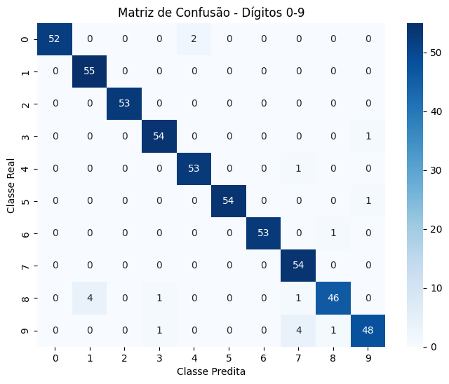

# 🎯 Projeto 03 — Avaliação de Modelos de Classificação (Dígitos 0-9)  

[](https://www.python.org/)  [](https://scikit-learn.org/stable/)  [](https://matplotlib.org/)  [](https://seaborn.pydata.org/)  

> Terceiro projeto do **Bootcamp Machine Learning** da [DIO](https://www.dio.me/) em parceria com a **BairesDev**.  
> Aplicação prática de **avaliação de modelos de classificação multiclasse** usando o dataset de dígitos de 0 a 9.  

---

## 📌 Sobre o Projeto  

Este projeto demonstra como calcular e analisar métricas de avaliação de modelos de classificação em Python, utilizando um dataset de dígitos (0–9).  

**O programa realiza:**  

1. Treinamento de um classificador RandomForest.  
2. Cálculo das métricas: **Acurácia, Precisão, Recall, F1-Score e Especificidade**.  
3. Plotagem da **matriz de confusão** com os valores de cada classe.  
4. Geração da **Curva ROC Multiclasse** utilizando abordagem One-vs-Rest.  

**Objetivos do projeto**:  
- 🧮 Avaliar desempenho de modelos de classificação multiclasse.  
- 📊 Visualizar matriz de confusão com contagem de predições corretas e incorretas.  
- 📈 Plotar curva ROC para cada classe do dataset.  
- 💾 Explorar ferramentas de análise visual para aprendizado de máquina.

**Métricas de avaliação e fórmulas**:  
| Métrica                | Fórmula                                         | Descrição                                            |
|------------------------|-------------------------------------------------|------------------------------------------------------|
| Acurácia               | (VP + VN) / (VP + VN + FP + FN)                 | Proporção de predições corretas                      |
| Precisão (Precision)   | VP / (VP + FP)                                  | Fração de positivos preditos que são corretos        |
| Sensibilidade (Recall) | VP / (VP + FN)                                  | Fração de positivos reais identificados corretamente |
| Especificidade         | VN / (VN + FP)                                  | Fração de negativos reais identificados corretamente |
| F1-Score               | 2 * (Precision * Recall) / (Precision + Recall) | Média harmônica entre precisão e recall              |


---

## **🛠️ Tecnologias e Ferramentas**  

- **Python 3.10+** ([link](https://www.python.org/))  
- **Scikit-Learn** → Treinamento do modelo e métricas  
- **Matplotlib** → Plotagem da curva ROC  
- **Seaborn** → Visualização da matriz de confusão  

---

## **📂 Estrutura do Projeto**  

```text
projeto-03-avaliacao-classificacao/
├── LICENSE                      # Arquivo de licença MIT
├── README.md                    # Este arquivo
├── curva_roc.png                # Gráfico da Curva de ROC, gerado pelo programa
├── matriz_confusao.png          # Gráfico da Matriz de Confusão, gerado pelo programa
└── projeto_calculo_metricas.py  # Script principal com todo o código do projeto
```

---

## 📊 Resultados

O modelo **RandomForest** é treinado com o dataset de dígitos (0–9).
As métricas de avaliação permitem analisar o desempenho geral e individual de cada classe:

| Métrica                      | Resultado (exemplo)                        |
| ---------------------------- | -------------------- |
| Acurácia                     |         0.97         |
| Precisão (média ponderada)   |         0.97         |
| Recall (média ponderada)     |         0.97         |
| F1-Score (média ponderada)   |         0.97         |  

**Matriz de Confusão: mostra acertos e erros de classificação por classe.**   
  

**Curva ROC Multiclasse: mostra o equilíbrio entre verdadeiros positivos e falsos positivos de um modelo.**    
  

---

## 🚀 Como Executar

```bash
# Clone o repositório
git clone https://github.com/rodrigoulart/projeto-03-calculo-de-metricas.git

# Acesse a pasta do projeto
cd projeto-03-avaliacao-classificacao

# Instale as dependências
pip install -r requirements.txt

# Execute o script principal
python main.py
```

O script irá:

Treinar o modelo RandomForest com o dataset de dígitos.

Calcular e exibir métricas de avaliação no terminal.

Gerar e plotar a matriz de confusão e a curva ROC para cada classe.

---

## 📚 Conceitos Aplicados

Matriz de Confusão → Avaliação detalhada do desempenho por classe.

Acurácia → Proporção de predições corretas.

Precisão / Recall / F1-Score → Avaliação de predições positivas e equilíbrio entre elas.

Curva ROC Multiclasse → Análise da taxa de verdadeiros positivos versus falsos positivos.

One-vs-Rest → Estratégia para gerar ROC em classificação multiclasse.

---

## 🏆 Créditos

Desenvolvido por Rodrigo Moraes, como parte dos desafios do Bootcamp de Machine Learning da DIO
 em parceria com a BairesDev.
 
📎 Repositório: github.com/rodrigoulart/projeto-03-calculo-de-metricas
